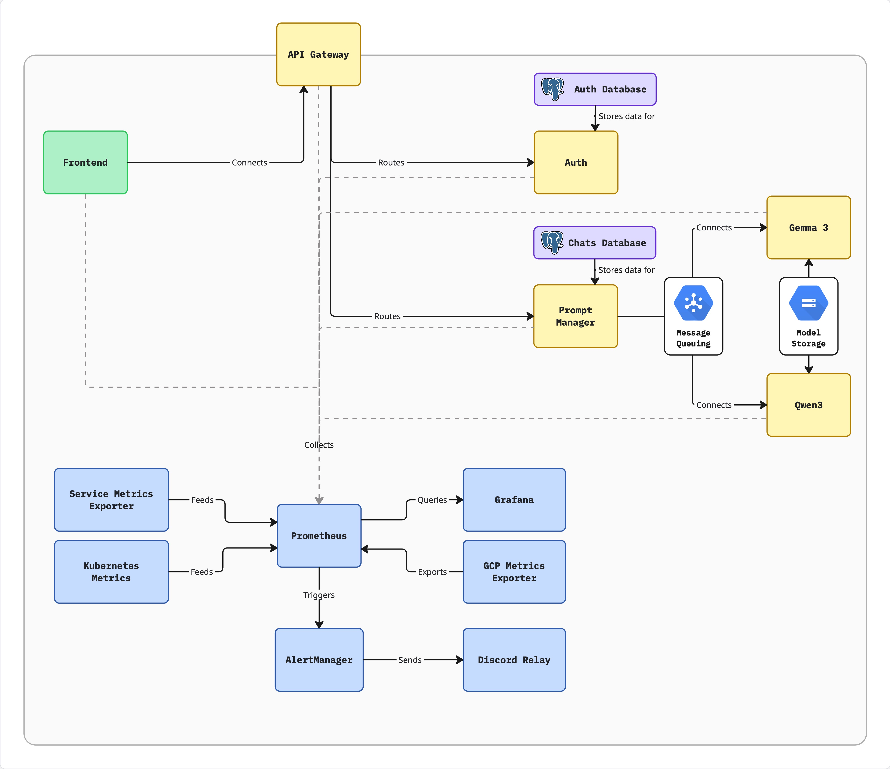
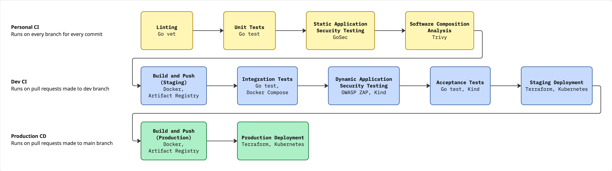

# DevOps Team 1 - AI Chat Application

A microservices-based AI chat application with complete CI/CD pipelines, infrastructure-as-code (Terraform), monitoring, and Kubernetes deployment on Google Cloud Platform.

**Try it out:** [http://35.239.187.233](http://35.239.187.233)

**Default credentials (Admin):**
- Username: admin
- Password: adminpass

**Default credentials (User):**
- Username: testuser
- Password: testpass

This will be hosted until Thursday, 5 March 2026.

## Table of Contents

- [Architecture Overview](#architecture-overview)
- [Repository Structure](#repository-structure)
- [Components](#components)
  - [Frontend Application](#frontend-application)
  - [Microservices](#microservices)
  - [Monitoring Stack](#monitoring-stack)
  - [Infrastructure](#infrastructure)
- [Local Development Setup](#local-development-setup)
  - [Prerequisites](#prerequisites)
  - [Environment Variables](#environment-variables)
  - [Running Locally](#running-locally)
- [GCP Deployment](#gcp-deployment)
  - [GCP Prerequisites](#gcp-prerequisites)
  - [Manual Deployment](#manual-deployment)
  - [Automated CI/CD Deployment](#automated-cicd-deployment)
- [Testing](#testing)
- [CI/CD Pipelines](#cicd-pipelines)

---

## Architecture Overview



### Request Flow

1. **Client** sends requests to the **Frontend** (React SPA)
2. **Frontend** communicates with **API Gateway** for all backend operations
3. **API Gateway** routes requests:
   - `/auth/*` and `/admin/*` → Auth Service
   - `/chats/*` and `/models` → Prompt Manager
4. **Auth Service** handles authentication (JWT) and user management
5. **Prompt Manager** handles chat sessions and LLM interactions via Pub/Sub

---

## Repository Structure

```
DevOps_Oct2025_Team1_Assignment/
├── app/                              # Frontend React application
│   ├── src/                          # React source code
│   ├── Dockerfile                    # Frontend container build
│   ├── kustomization.yaml            # K8s Kustomize config
│   └── package.json                  # Node.js dependencies
│
├── services/                         # Backend microservices
│   ├── api-gateway.service/          # API Gateway (Go)
│   │   ├── main.go                   # Gateway routing logic
│   │   ├── Dockerfile                # Container build
│   │   └── kustomization.yaml        # K8s deployment
│   │
│   ├── auth.service/                 # Authentication service (Go)
│   │   ├── main.go                   # Auth & user management
│   │   ├── db/                       # Database init scripts
│   │   ├── Dockerfile                # Container build
│   │   └── kustomization.yaml        # K8s deployment
│   │
│   ├── prompt-manager.service/       # Prompt/Chat manager (Go)
│   │   ├── main.go                   # Chat handling & Pub/Sub
│   │   ├── db/                       # Database init scripts
│   │   ├── Dockerfile                # Container build
│   │   └── kustomization.yaml        # K8s deployment
│   │
│   └── llm.service/                  # LLM inference services (Production)
│       ├── deployments.yaml          # Gemma3 & Qwen3 llama.cpp servers
│       ├── services.yaml             # K8s service definitions
│       └── serviceaccounts.yaml      # GCS Fuse permissions
│
├── terraform/                        # Infrastructure as Code
│   ├── main.tf                       # Main Terraform config
│   ├── gke.tf                        # GKE cluster config
│   ├── vpc.tf                        # VPC networking
│   ├── iam.tf                        # IAM & service accounts
│   ├── gcs.tf                        # Cloud Storage buckets
│   ├── variables.tf                  # Input variables
│   ├── outputs.tf                    # Output values
│   └── environments/                 # Environment-specific configs
│       ├── staging.tfvars            # Staging environment
│       └── production.tfvars         # Production environment
│
├── monitoring/                       # Observability stack
│   ├── prometheus/                   # Metrics collection
│   ├── grafana/                      # Dashboards
│   ├── alertmanager/                 # Alert routing
│   ├── discord-relay/                # Discord notifications
│   ├── gcp-exporter/                 # GCP metrics exporter
│   ├── metrics-exporter/             # Business metrics exporter
│   └── exporters/                    # Node & K8s exporters
│
├── k8s-local/                        # K8s resources for local testing
│   ├── mock-llm.service/             # Mock LLM for local dev
│   └── pubsub-emulator.yaml          # Pub/Sub emulator
│
├── .github/workflows/                # CI/CD pipelines
│   ├── personal-ci.yml               # Generic branch CI (runs on any branch) 
│   ├── dev-ci.yml                    # Dev branch CI
│   ├── main-ci.yml                   # Main branch CI
│   ├── dev-cd.yml                    # Staging deployment
│   ├── main-cd.yml                   # Production deployment
│   └── reusable-gke-deploy.yml       # Reusable deploy workflow
│
├── docker-compose.yml                # Local development stack
├── docker-compose.test.yml           # Integration test override
├── run-integration-tests.ps1         # Script to run integration tests (Windows)
├── run-integration-tests.sh          # Script to run integration tests (Linux/Mac)
└── .env                              # Environment variables
```

---

## Components

### Frontend Application

**Location:** `app/`

| Property | Value |
|----------|-------|
| Framework | React 19 + TypeScript + Vite |
| UI Library | Radix UI, shadcn/ui, Tailwind CSS 4 |
| Port | 5173 |
| Build | `npm run build` (Vite SPA) |

The frontend is a single-page application that communicates with the API Gateway. It provides:
- User authentication (login/logout)
- Chat interface for LLM interactions
- Admin user management panel

### Microservices

#### API Gateway

**Location:** `services/api-gateway.service/`

| Property | Value |
|----------|-------|
| Language | Go |
| Port | 8000 |
| Purpose | Request routing & CORS handling |

Routes:
- `/auth/*` → Auth Service (port 8001)
- `/admin/*` → Auth Service (port 8001)
- `/chats/*` → Prompt Manager (port 8002)
- `/models` → Prompt Manager (port 8002)

#### Auth Service

**Location:** `services/auth.service/`

| Property | Value |
|----------|-------|
| Language | Go |
| Port | 8001 |
| Database | PostgreSQL (`app_db`) |
| Auth | JWT tokens |

Endpoints:
- `GET /health` - Health check
- `POST /login` - User authentication
- `GET /validate` - Token validation
- `GET/POST/PUT/DELETE /users` - User CRUD (protected)

#### Prompt Manager

**Location:** `services/prompt-manager.service/`

| Property | Value |
|----------|-------|
| Language | Go |
| Port | 8002 |
| Database | PostgreSQL (`chats_db`) |
| Messaging | Google Cloud Pub/Sub |

Endpoints:
- `GET /health` - Health check
- `GET /models` - List available LLM models
- `GET/POST /chats` - Chat management (protected)

The Prompt Manager uses Pub/Sub for async LLM communication with a worker pool pattern.

#### LLM Services

**Location:** `services/llm.service/` (Production) | `k8s-local/mock-llm.service/` (Local)

| Environment | Implementation | Models |
|-------------|----------------|--------|
| Local/Testing | Mock LLM (Go) | Simulated responses |
| Production | llama.cpp server | Gemma3 (270M), Qwen3 (0.6B) |

**Production LLM Architecture:**
- Models stored in GCS bucket (`${PROJECT_ID}-llm-models`)
- GCS Fuse mounts bucket to pods as `/models` volume
- `model-downloader` Job fetches GGUF files from HuggingFace on first deploy
- llama.cpp servers expose OpenAI-compatible API on port 8000

**Environment Variables:**
| Variable | Description | Example |
|----------|-------------|---------|
| `GEMMA3_SERVICE_URL` | Gemma3 LLM endpoint | `http://gemma3-service:8000` |
| `QWEN3_SERVICE_URL` | Qwen3 LLM endpoint | `http://qwen3-service:8000` |
| `LLM_BUCKET_NAME` | GCS bucket for models | `project-id-llm-models` |
| `MOCK_LLM_IMAGE` | Mock LLM image (local) | `mock-llm:latest` |

### Monitoring Stack

**Location:** `monitoring/`

| Component | Purpose | Port |
|-----------|---------|------|
| Prometheus | Metrics collection & alerting | 9090 |
| Grafana | Dashboards & visualization | 3000 |
| AlertManager | Alert routing | 9093 |
| Discord Relay | Discord notifications | 8080 |
| GCP Exporter | GCP-specific metrics | 8888 |
| Metrics Exporter | Custom app metrics | 9090 |
| Node Exporter | Hardware/OS metrics | 9100 |
| Kube State Metrics | K8s resource metrics | 8080 |

### Infrastructure

**Location:** `terraform/`

Terraform provisions the following GCP resources:
- **GKE Cluster** - Kubernetes cluster with autoscaling (1-3 nodes)
- **VPC Network** - Private VPC with Cloud NAT
- **Artifact Registry** - Docker image storage
- **Pub/Sub** - Message queue for async LLM calls
- **Cloud Storage** - LLM models bucket & Terraform state
- **IAM** - Service accounts with Workload Identity

---

## Local Development Setup

### Prerequisites

- [Docker](https://docs.docker.com/get-docker/) & Docker Compose
- [Go 1.25+](https://golang.org/dl/) (for running tests)
- [Node.js 22+](https://nodejs.org/) (for frontend development)

### Environment Variables

Create a `.env` file in the project root with the following variables:

```bash
# ============================================
# Database Configuration
# ============================================
# Auth Service Database
POSTGRES_DB=app_db
POSTGRES_USER=app_user
POSTGRES_PASSWORD=app_password
POSTGRES_HOST=auth-db
POSTGRES_PORT=5432

# Chats/Prompt Manager Database
CHATS_POSTGRES_DB=chats_db
CHATS_POSTGRES_USER=app_user
CHATS_POSTGRES_PASSWORD=app_password
CHATS_POSTGRES_HOST=chats-db
CHATS_POSTGRES_PORT=5432

# ============================================
# Initial User Seeding
# ============================================
DEFAULT_TESTUSER_USERNAME=testuser
DEFAULT_TESTUSER_PASSWORD=testpass
DEFAULT_ADMIN_USERNAME=admin
DEFAULT_ADMIN_PASSWORD=adminpass

# ============================================
# Authentication
# ============================================
JWT_SECRET=super_secret_testing_key_change_in_prod

# ============================================
# Service URLs (Internal Docker Network)
# ============================================
AUTH_SERVICE_URL=http://auth:8001
ADMIN_SERVICE_URL=http://auth:8001
PROMPT_MANAGER_SERVICE_URL=http://prompt-manager:8002

# ============================================
# Frontend Configuration
# ============================================
VITE_API_URL=http://localhost:8000

# ============================================
# Pub/Sub Configuration (Local Emulator)
# ============================================
PUBSUB_EMULATOR_HOST=pubsub-emulator:8085
PUBSUB_PROJECT_ID=local-project

# ============================================
# Container Images (Local)
# ============================================
API_GATEWAY_IMAGE=api-gateway.service:latest
AUTH_SERVICE_IMAGE=auth.service:latest
PROMPT_MANAGER_SERVICE_IMAGE=prompt-manager.service:latest
```

### Running Locally

1. **Clone the repository:**
   ```bash
   git clone https://github.com/DevOps-Oct2025-Team1/DevOps_Oct2025_Team1_Assignment.git
   cd DevOps_Oct2025_Team1_Assignment
   ```

2. **Create the `.env` file** with the variables above.

3. **Start all services:**
   ```bash
   docker-compose up --build
   ```

4. **Access the application:**
   - Frontend: http://localhost:5173
   - API Gateway: http://localhost:8000
   - Pub/Sub Emulator: http://localhost:8085

5. **Default credentials:**
   - Test User: `testuser` / `testpass`
   - Admin User: `admin` / `adminpass`

6. **Stop services:**
   ```bash
   docker-compose down
   ```

7. **Reset databases (clean start):**
   ```bash
   docker-compose down -v
   docker-compose up --build
   ```

### Local Kubernetes Testing (Optional)

For testing Kubernetes deployments locally using Kind or Minikube:

```bash
# Build mock LLM image
docker build -t mock-llm:latest ./k8s-local/mock-llm.service

# Set environment variables for local K8s
export MOCK_LLM_IMAGE=mock-llm:latest
export API_GATEWAY_IMAGE=api-gateway.service:latest
export AUTH_SERVICE_IMAGE=auth.service:latest
export PROMPT_MANAGER_SERVICE_IMAGE=prompt-manager.service:latest

# Deploy mock LLMs and Pub/Sub emulator
cd k8s-local && cat mock-llm.yaml | envsubst | kubectl apply -f - && cd ..
kubectl apply -f k8s-local/pubsub-emulator.yaml
```

> **Note:** The mock LLM service returns simulated responses and is only for local testing. Production uses real llama.cpp servers with actual models.

---

## GCP Deployment

### GCP Prerequisites

1. **GCP Project** with billing enabled
2. **Service Account** with the following roles:
   - `roles/container.admin` - GKE management
   - `roles/compute.admin` - Compute resources
   - `roles/storage.admin` - GCS buckets
   - `roles/artifactregistry.admin` - Docker registry
   - `roles/pubsub.admin` - Pub/Sub management
   - `roles/iam.serviceAccountUser` - Service account usage

3. **Required GCP APIs** (enabled via Terraform):
   - Compute Engine API
   - Kubernetes Engine API
   - Artifact Registry API
   - Cloud Pub/Sub API
   - Cloud Resource Manager API
   - IAM API

4. **Tools:**
   - [gcloud CLI](https://cloud.google.com/sdk/docs/install)
   - [kubectl](https://kubernetes.io/docs/tasks/tools/)
   - [Terraform 1.7+](https://www.terraform.io/downloads)
   - [Kustomize](https://kubectl.docs.kubernetes.io/installation/kustomize/)

### Manual Deployment

#### 1. Authenticate with GCP

```bash
gcloud auth login
gcloud auth application-default login
gcloud config set project YOUR_PROJECT_ID
```

#### 2. Create Terraform State Bucket

```bash
PROJECT_ID="your-project-id"
REGION="us-central1"  # or asia-southeast1 for staging

gsutil mb -l $REGION "gs://${PROJECT_ID}-terraform-state"
gsutil versioning set on "gs://${PROJECT_ID}-terraform-state"
```

#### 3. Initialize and Apply Terraform

```bash
cd terraform

# Initialize Terraform with GCS backend
terraform init \
  -backend-config="bucket=${PROJECT_ID}-terraform-state" \
  -backend-config="prefix=terraform/state/production"

# Review the plan
terraform plan -var-file="environments/production.tfvars"

# Apply infrastructure
terraform apply -var-file="environments/production.tfvars"
```

#### 4. Configure kubectl

```bash
# Get cluster credentials (command provided in terraform output)
gcloud container clusters get-credentials devops-gke \
  --region us-central1 \
  --project YOUR_PROJECT_ID
```

#### 5. Build and Push Docker Images with Cloud Build

Use Google Cloud Build for building and pushing images. Each service has a `cloudbuild.yaml` configuration file.

```bash
PROJECT_ID="your-project-id"
REGION="us-central1"
REPO="production-docker-repo"

# Build and push Auth Service
gcloud builds submit ./services/auth.service \
  --config=./services/auth.service/cloudbuild.yaml \
  --substitutions=_REGION=${REGION},_REPOSITORY=${REPO}

# Build and push API Gateway
gcloud builds submit ./services/api-gateway.service \
  --config=./services/api-gateway.service/cloudbuild.yaml \
  --substitutions=_REGION=${REGION},_REPOSITORY=${REPO}

# Build and push Prompt Manager
gcloud builds submit ./services/prompt-manager.service \
  --config=./services/prompt-manager.service/cloudbuild.yaml \
  --substitutions=_REGION=${REGION},_REPOSITORY=${REPO}

# Build and push Frontend
gcloud builds submit ./app \
  --config=./app/cloudbuild.yaml \
  --substitutions=_REGION=${REGION},_REPOSITORY=${REPO},_VITE_API_URL=https://your-api-domain.com
```

**Cloud Build Benefits:**
- Builds run in GCP infrastructure (no local Docker required)
- Automatic authentication with Artifact Registry
- Build history and logs in GCP Console
- Consistent build environment across team members

#### 6. Deploy to Kubernetes

Set required environment variables and deploy with Kustomize:

```bash
export API_GATEWAY_IMAGE="${REPO}/api-gateway:latest"
export AUTH_SERVICE_IMAGE="${REPO}/auth-service:latest"
export PROMPT_MANAGER_SERVICE_IMAGE="${REPO}/prompt-manager-service:latest"
export FRONTEND_IMAGE="${REPO}/frontend:latest"

# Database secrets
export POSTGRES_DB="app_db"
export POSTGRES_USER="app_user"
export POSTGRES_PASSWORD="secure_password_here"
export JWT_SECRET="production_jwt_secret"
export DEFAULT_TESTUSER_USERNAME="testuser"
export DEFAULT_TESTUSER_PASSWORD="secure_password"
export DEFAULT_ADMIN_USERNAME="admin"
export DEFAULT_ADMIN_PASSWORD="secure_admin_password"

# Chats database
export CHATS_POSTGRES_DB="chats_db"
export CHATS_POSTGRES_USER="app_user"
export CHATS_POSTGRES_PASSWORD="secure_password_here"

# Pub/Sub (production uses real Pub/Sub, not emulator)
export PUBSUB_EMULATOR_HOST="" # Very important! If not empty, it will use the emulator
export PUBSUB_PROJECT_ID="${PROJECT_ID}"
export PUBSUB_TOPIC_ID="prompt-requests"
export PUBSUB_SUBSCRIPTION_ID="prompt-requests-sub"

# LLM Services (GCS bucket for model storage)
export LLM_BUCKET_NAME="${PROJECT_ID}-llm-models"

# Deploy services
cd services/api-gateway.service && kustomize build . | envsubst | kubectl apply -f - && cd ../..
cd services/auth.service && kustomize build . | envsubst | kubectl apply -f - && cd ../..
cd services/prompt-manager.service && kustomize build . | envsubst | kubectl apply -f - && cd ../..
cd app && kustomize build . | envsubst | kubectl apply -f - && cd ..

# Deploy LLM services (downloads models and starts llama.cpp servers)
cd services/llm.service && cat deployments.yaml | envsubst | kubectl apply -f - && cd ../..
kubectl apply -f services/llm.service/services.yaml
kubectl apply -f services/llm.service/serviceaccounts.yaml

# Deploy monitoring
kubectl apply -f monitoring/prometheus/
kubectl apply -f monitoring/grafana/
kubectl apply -f monitoring/alertmanager/
kubectl apply -f monitoring/exporters/
```

> **Note:** The LLM service uses GCS Fuse to mount model files from a GCS bucket. The `model-downloader` Job automatically downloads the GGUF model files (Gemma3, Qwen3) from HuggingFace to the bucket on first deployment.

#### 7. Verify Deployment

```bash
kubectl get pods
kubectl get services
kubectl get ingress
```

### Automated CI/CD Deployment

The repository includes GitHub Actions workflows for automated deployment.

#### Required GitHub Secrets

Configure the following secrets in your GitHub repository settings:

**Staging Environment:**
| Secret | Description |
|--------|-------------|
| `GCP_PROJECT_ID_STAGING` | Staging GCP project ID |
| `GCP_SA_KEY_STAGING` | Service account JSON key |
| `GKE_REGION_STAGING` | GCP region (e.g., `asia-southeast1`) |
| `GKE_CLUSTER_STAGING` | GKE cluster name |
| `ARTIFACT_REPO_STAGING` | Artifact Registry repo name |
| `POSTGRES_DB` | Auth database name |
| `POSTGRES_USER` | Database username |
| `POSTGRES_PASSWORD` | Database password |
| `JWT_SECRET` | JWT signing secret |
| `DEFAULT_TESTUSER_USERNAME` | Default test user |
| `DEFAULT_TESTUSER_PASSWORD` | Default test user password |
| `DEFAULT_ADMIN_USERNAME` | Default admin user |
| `DEFAULT_ADMIN_PASSWORD` | Default admin password |
| `CHATS_POSTGRES_DB` | Chats database name |
| `CHATS_POSTGRES_USER` | Chats database username |
| `CHATS_POSTGRES_PASSWORD` | Chats database password |
| `PUBSUB_PROJECT_ID` | Pub/Sub project ID |
| `PUBSUB_TOPIC_ID` | Pub/Sub topic name |
| `PUBSUB_SUBSCRIPTION_ID` | Pub/Sub subscription name |
| `PUBSUB_EMULATOR_HOST` | Empty for production, set for local emulator |
| `LLM_BUCKET_NAME` | GCS bucket name for LLM models |
| `VITE_API_URL_STAGING` | Frontend API URL |

**Production Environment:** Same secrets with `_PROD` suffix.

#### Deployment Flow

```
Feature Branch → dev branch (PR) → Staging Deployment
                         ↓
           dev → main (PR) → Production Deployment
```

1. **Push to `dev` branch** triggers:
   - Integration tests
   - Docker image builds
   - DAST security scan
   - Deployment to staging GKE cluster

2. **Push to `main` branch** triggers:
   - Production deployment to production GKE cluster

---

## Testing

### Unit Tests

Run unit tests locally:

```bash
# Application services
cd services/auth.service && go test -short -v ./...
cd ../api-gateway.service && go test -short -v ./...
cd ../prompt-manager.service && go test -short -v ./...

# Monitoring services
cd ../../monitoring/discord-relay && go test -v ./...
cd ../metrics-exporter && go test -v ./...
cd ../gcp-exporter && go test -v ./...
```

### Integration Tests

Run integration tests locally with Docker Compose:

```bash
# Start test environment
docker-compose -f docker-compose.yml -f docker-compose.test.yml up -d

# Wait for services to be ready
sleep 30

# Run tests
cd services/auth.service && go test -v ./...
cd ../api-gateway.service && go test -v ./...
cd ../prompt-manager.service && go test -v ./...

# Cleanup
docker-compose -f docker-compose.yml -f docker-compose.test.yml down
```

Or use the provided test scripts:

```bash
# Linux/macOS
./run-integration-tests.sh

# Windows (PowerShell)
./run-integration-tests.ps1
```

### Acceptance Tests

Acceptance tests verify end-to-end user flows:

```bash
cd services
go test -v  ./acceptance_test.go -timeout 5m -timeout 5m
```

---

## CI/CD Pipelines



### Workflow Overview

| Workflow | Trigger | Purpose |
|----------|---------|---------|
| `personal-ci.yml` | Push/PR to any branch | Linting, unit tests, SAST (GoSec), SCA (Trivy) |
| `dev-ci.yml` | Push to `dev` | Integration tests, build images, DAST scan, acceptance tests |
| `main-ci.yml` | Push to `main` | Build production images |
| `dev-cd.yml` | After `dev-ci` success | Deploy to staging |
| `main-cd.yml` | After `main-ci` success | Deploy to production |

### CI Pipeline Stages

**Personal CI (`personal-ci.yml`) - Runs on all branches:**

1. **Linting** - `go vet` static analysis for all Go services
2. **Unit Tests** - Fast isolated tests for:
   - Auth Service
   - API Gateway Service
   - Prompt Manager Service
   - Discord Relay
   - Metrics Exporter
   - GCP Exporter
3. **SAST (GoSec)** - Static Application Security Testing for Go code vulnerabilities
4. **SCA (Trivy)** - Software Composition Analysis for dependency vulnerabilities

**Dev/Main CI (`dev-ci.yml`, `main-ci.yml`) - Additional stages:**

5. **Integration Tests** - Run Go tests with Docker Compose (full service stack)
6. **Build & Push Images** - Build Docker images to Artifact Registry via Cloud Build
7. **DAST Scan** - OWASP ZAP dynamic security scan against running services
8. **Acceptance Tests** - End-to-end user flow validation

### CD Pipeline Stages

1. **Terraform** - Provision/update infrastructure
2. **Deploy Services** - Apply Kubernetes manifests with Kustomize
3. **Deploy Monitoring** - Deploy observability stack
4. **Health Checks** - Verify deployment rollout status

---

## Environment Configuration

### Staging vs Production

| Configuration | Staging | Production |
|--------------|---------|------------|
| GCP Region | `asia-southeast1` | `us-central1` |
| GKE Nodes | 1-3 (autoscaling) | 1-3 (autoscaling) |
| Machine Type | `e2-standard-4` | `e2-standard-4` |
| Deletion Protection | Disabled | Enabled |
| Artifact Registry | `staging-docker-repo` | `production-docker-repo` |

---

## License

This project is developed as part of the DevOps Assignment by Team 1, October 2025 Semester, Ngee Ann Polytechnic Information Technology Diploma.
